# 🔥 AI Resume + Cover Letter Builder 🔥

<p align="center">
  
  
  
  
</p>

<p align="center">
  <i>Forget writer's block. Build a job-winning resume and cover letter in minutes, not hours.</i>
</p>

---

## 🌟 About The Project

This isn't just another resume builder. It's an intelligent career assistant powered by the Google Gemini AI. This full-stack application was built to streamline the tedious process of crafting job application materials, allowing users to generate high-quality, professional resumes and cover letters with ease. 

From selecting a template to fine-tuning the AI-generated content with a live preview, every part of the experience is designed to be intuitive, fast, and effective. The standout feature is the **AI-Styled Template**, where the AI acts not just as a writer, but as a designer, structuring the resume content into a visually appealing, professional layout.

*(You can add your project screenshots or a showcase image here later)*

---

## ✨ Core Features

- **🧠 AI-Powered Content Generation**: Leverages Google Gemini to automatically create compelling, professional text based on your profile.
- **🎨 Multiple Template Options**:
  - **Classic, Modern, Minimalist**: Timeless, professional templates for any industry.
  - **AI-Styled Template (Beta)**: A cutting-edge feature where the AI structures the content into a beautiful, pre-designed layout.
- **✍️ Live Preview & Real-Time Editing**: Instantly see your final document and edit the AI-generated content on the fly. No more guessing games.
- **🗣️ Customizable AI Prompts**: Take control of the AI by providing specific instructions to tailor the tone and focus of your documents.
- **📄 Instant PDF Downloads**: Generate and download high-quality, pixel-perfect PDFs of your resume and cover letter.
- **🔐 Secure & Persistent**: Full user authentication via Clerk.dev, with all your progress saved in the browser's session storage.

---

## 🚀 Technology Stack & Philosophy

This project was built with a modern, robust, and scalable tech stack, chosen for performance and developer experience.

- **Frontend**: **React (with Vite)** was chosen for its lightning-fast development server and optimized build process. **Tailwind CSS** allows for rapid, utility-first styling.
- **Backend**: **Node.js & Express** provide a lightweight, powerful, and non-blocking foundation for the API.
- **AI Integration**: The **Google Gemini API** was selected for its advanced reasoning and content generation capabilities.
- **Templating & PDF**: **EJS** is used for its simplicity in rendering server-side HTML, which is then converted to a PDF using **Puppeteer** for perfect print-fidelity.
- **Authentication**: **Clerk.dev** handles the entire user authentication flow, providing a secure and seamless sign-in experience out-of-the-box.

---

## 🔄 Project Workflow

Here is a visual representation of the application's architecture and user flow:

```mermaid
graph TD
    subgraph "User Journey"
        A["👤 Start: User Enters App"] --> B{"Sign In / Sign Up"};
        B --> C["📝 Fill Profile Information"];
        C --> D["🎨 Select Template<br>(Classic, Modern, AI-Styled)"];
        D --> E["💬 Add Custom Prompts"];
    end

    subgraph "AI Generation Core"
        E --> F("🚀 Trigger AI Generation");
        F --> G["BACKEND: Build Prompt<br>with Profile + Style"];
        G --> H{{"🤖 Google Gemini API"}};
        H --> I["BACKEND: Receive AI Response<br>(Text or JSON)"];
    end

    subgraph "Finalization"
        I --> J["FRONTEND: Live Preview<br>Updates in Real-Time"];
        J --> K["✍️ User Edits Content<br>(Text or JSON)"];
        K --> L{"Download PDF"};
        L --> M["BACKEND: Render Final HTML<br>with EJS"];
        M --> N["PUPPETEER: Convert HTML to PDF"];
        N --> O["📄 User Receives PDF"];
    end

    style B fill:#E9D5FF,stroke:#8B5CF6
    style F fill:#DBEAFE,stroke:#3B82F6
    style H fill:#D1FAE5,stroke:#10B981
    style L fill:#DBEAFE,stroke:#3B82F6
    style O fill:#A7F3D0,stroke:#10B981
```



---

## 🔧 Setup and Installation

Follow these steps to get the project running on your local machine.

**Prerequisites:**
- Node.js (v18 or later recommended)
- npm

**1. Clone the Repository**
```bash
git clone https://github.com/your-username/your-repository-name.git
cd your-repository-name
```

**2. Configure Backend**
```bash
# Navigate to the backend directory
cd backend

# Install dependencies
npm install
```
- **Create Environment File**: In the `backend` directory, create a `.env` file.
- **Add API Key**: Add your Google Gemini API key to the `.env` file:
    ```
    GEMINI_API_KEY=your_gemini_api_key_here
    ```

**3. Configure Frontend**
```bash
# Navigate to the frontend directory from the root
cd ../frontend-vite

# Install dependencies
npm install
```

**4. Run the Application**

You'll need two separate terminals running simultaneously.

- **Terminal 1: Start Backend**
    ```bash
    # From the project root
    node --env-file=backend/.env backend/server.js
    ```
    *(Backend will run on `http://localhost:5000`)*

- **Terminal 2: Start Frontend**
    ```bash
    # From the project root
    cd frontend-vite
    npm run dev
    ```
    *(Frontend will be available at `http://localhost:5173`)*

---

## 🔮 Future Roadmap

- [ ] Add more template designs.
- [ ] Implement a "Share" feature to generate a public link to a resume.
- [ ] Allow users to save and manage multiple versions of their documents.
- [ ] Integrate with LinkedIn to pre-fill profile information.

---

## 📸 Screenshots & Demonstration

*(I will add screenshots and a link to a full video demonstration here later.)* 